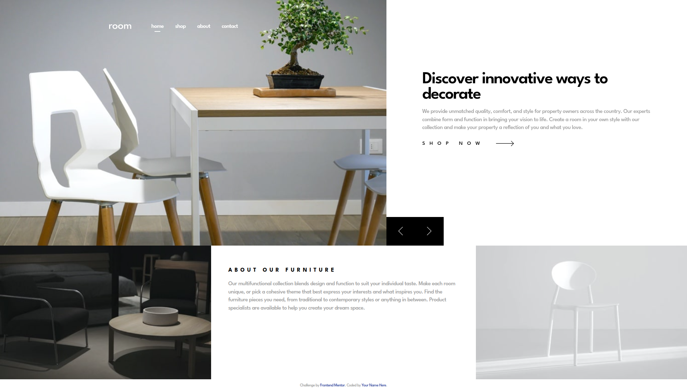

# Frontend Mentor - Room homepage solution

This is a solution to the [Room homepage challenge on Frontend Mentor](https://www.frontendmentor.io/challenges/room-homepage-BtdBY_ENq).

## Overview

This is a landing page for furniture and home decor company that showcases what they can offer to clients. On this page users can:

- View the optimal layout for the site depending on their device's screen size
- See hover states for all interactive elements on the page
- Navigate the slider using either their mouse/trackpad or keyboard

### Screenshot

### Links

<!-- Add link -->

### Built with

- Semantic HTML5 markup
- SCSS (Sass) - compiled to CSS
- Flexbox
- Vanilla JavaScript (DOM manipulation)
- BEM methodology

## Acknowledgments

- Challenge by [Frontend Mentor](https://www.frontendmentor.io).
